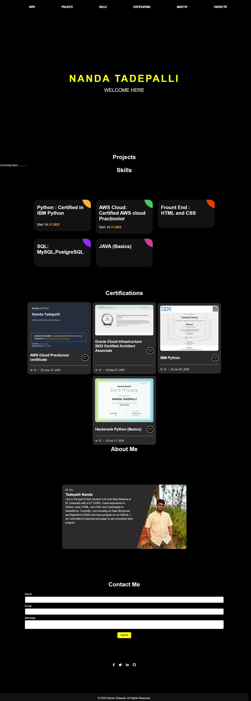

# Portfolio2.0
Welcome to the **final** version of my personal portfolio website!  
This project showcases my journey in web development and is built to be **fully responsive** — meaning you can enjoy it on any device, be it **desktop**, **tablet**, or **smartphone**! 🖥️📱

## 🚀 Features
- **Responsive Design**: Looks great on screens of all sizes! 💻📱
- **Minimalist UI**: Clean, sleek, and easy to navigate 🎨
- **Optimized Performance**: Fast loading times for a smooth experience ⚡

## 💻 Tech Stack
- **HTML**: Structuring the foundation of the website 🏗️
- **CSS**: Adding style and visual appeal 🎨
- **JavaScript**: Bringing interactivity to life ✨

## 🌐 Check it out!
You can explore the website directly [here](https://nandatadepalli.github.io/Portfolio2.0/index.html) and see how it performs across different devices!  
Feel free to leave a ⭐ if you like it or fork the project to make it your own!

## 🛠️ How to Get Started

If you want to clone and run this project locally, follow these steps:

1. **Clone the repository**  
   Run the following command in your terminal:
   ```bash
   git clone https://github.com/NandaTadepalli/Portfolio2.0.git

  
*This is a preview of my fully responsive portfolio website!*
