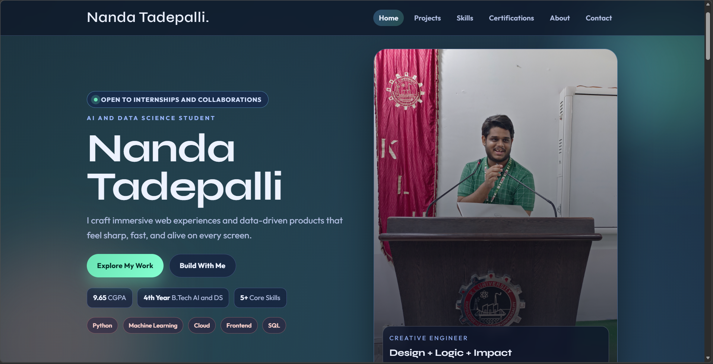

# Portfolio 2.0

A modern, high-impact personal portfolio website built with HTML, CSS, and JavaScript.

This version includes a major UI/UX redesign with futuristic visuals, upgraded project showcase cards, a reworked About section, premium button styles, and a modern footer experience.

## Live Demo

- Website: https://nandatadepalli.github.io/Portfolio2.0/index.html

## Release 2.0

Release 2.0 introduces a full visual and interaction upgrade across the website.

### Highlights

- New premium hero layout with cinematic visuals and motion effects
- Redesigned Projects section with six showcased projects
- Added project cards for:
   - Vehicle Classification System
   - Grievance Platform
   - Exam Seating Arrangement using AI
- Reimagined About section with dynamic floating elements
- Reworked Skills and Certifications with high-tech styling
- Improved button system with icon-based actions and enhanced hover states
- Updated profile details:
   - Current year: 4th Year
   - CGPA: 9.65
- Modernized footer UI and updated social links (GitHub, LinkedIn, Instagram)
- Fully responsive behavior tuned for desktop and mobile

## Tech Stack

- HTML5
- CSS3
- JavaScript (Vanilla)
- Font Awesome (icons)
- EmailJS (contact form integration)

## Project Structure

```text
Portfolio2.0/
   index.html
   style.css
   README.md
   media/
```

## Run Locally

1. Clone the repository:

```bash
git clone https://github.com/NandaTadepalli/Portfolio2.0.git
```

2. Open the folder:

```bash
cd Portfolio2.0
```

3. Launch index.html in your browser.

## Contact and Socials

- GitHub: https://github.com/NandaTadepalli
- LinkedIn: https://www.linkedin.com/in/nanda-tadepalli/
- Instagram: https://www.instagram.com/tadepallinanda/

## Preview


